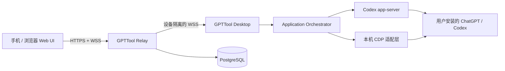

<p align="center">
  
</p>

<h1 align="center">GPTTool</h1>

<p align="center">
  面向 macOS 与 Windows 的 Codex 远程工作空间。<br />
  在手机或浏览器中安全连接自己的电脑，继续任务、查看进度并处理审批。
</p>

<p align="center">
  
  
  
</p>

> [!IMPORTANT]
> GPTTool 采用 **PolyForm Noncommercial 1.0.0**：允许个人、学习、研究和其他非商业用途下查看、修改及再分发源码，但**禁止未经授权的商业使用**。这属于 source-available（源码可用），并非 OSI 定义的开源软件。

## 为什么是 GPTTool

GPTTool 不提供云端模型，也不代管你的 ChatGPT/Codex 登录凭据。它在用户自己的电脑上运行本地控制服务，通过加密中继把远程 Web 操作转发回该设备。官方客户端仍是账号、任务与历史记录的主要数据源。

核心能力：

- **两种连接模式**：`CDP + app-server` 官方同步模式，以及更耐 UI 变化的纯 `app-server` 模式；
- **公网远程控制**：账户、设备二维码绑定、WebSocket 中继与多设备隔离；
- **任务体验**：任务目录、历史消息、附件、消息队列、审批、模型与推理强度设置；
- **跨平台桌面端**：Electron 桌面应用、托盘、登录启动、防系统睡眠（允许屏幕熄灭）；
- **自托管服务**：Node.js 中继、PostgreSQL 持久化、Nginx HTTPS 反向代理；
- **安全更新**：Ed25519 签名清单、安装包 SHA-256 与同源 HTTPS 校验。

## 架构概览



更完整的数据边界与组件说明见 [架构文档](docs/ARCHITECTURE.zh-CN.md)。

## 快速开始

### 环境要求

- Node.js `22.12+` 与 npm；
- macOS 13+ 或 Windows 10/11 x64；
- 用户自行安装并登录的 ChatGPT/Codex 官方客户端；
- 自托管公网访问时：Linux 服务器、HTTPS 域名、Node.js 22、PostgreSQL 14+、Nginx。

### 本地开发

```bash
git clone https://github.com/lvyq/GPTTool.git
cd GPTTool
npm ci
cp .env.example .env
npm run check
npm test
npm run dev
```

公开源码默认使用 `example.com` 占位配置，**不会连接维护者的生产服务器**。请在 `.env` 或应用设置中填写自己的中继地址。

### 构建桌面端

```bash
# 仅构建 TypeScript 与前端资源
npm run build

# 生成当前平台安装包
npm run pack
```

macOS 安装包应在 macOS 构建并完成 Developer ID 签名/公证；Windows 安装包建议在 Windows 或 CI 的 Windows runner 中构建并使用代码签名证书签名。

### 部署公网中继

1. 按 [自托管指南](docs/SELF_HOSTING.zh-CN.md) 创建专用用户与 PostgreSQL 数据库；
2. 将 `deploy/relay-server/.env.example` 复制到服务器外部的受限环境文件；
3. 构建 Web UI 与二维码解码器；
4. 配置 systemd 和 Nginx 示例；
5. 构建桌面端时设置自己的 `GPTTOOL_RELAY_URL`。

```bash
npm run build:web
npm run build:gateway
cd deploy/relay-server
npm ci --omit=dev
node server.mjs
```

## 连接模式

| 模式 | 实现 | 优点 | 限制 |
| --- | --- | --- | --- |
| 官方同步 | CDP + app-server | Web 与官方客户端操作更接近实时一致 | 官方 UI 大改时可能需要适配 |
| 独立服务 | app-server | 更少依赖官方界面结构、兼容性更稳 | 部分 UI 状态不会与官方客户端逐帧同步 |

CDP 只监听本机回环地址，不经公网暴露。公网中继也不能直接访问调试端口。

## 配置与数据

- 桌面设置：保存在 Electron `userData/settings.json`，权限为当前用户可读；
- 官方会话：由官方客户端持有，GPTTool 不替换官方数据库；
- 中继数据：用户、设备、会话、队列与压缩快照写入 PostgreSQL；
- 密钥与口令：只通过环境变量或服务器外部的 `0600/0640` 环境文件提供；
- 附件：传输前受数量与大小限制，临时文件使用后清理。

详见 [安全模型](docs/SECURITY_MODEL.zh-CN.md) 与 [.env.example](.env.example)。

## 开发与贡献

```bash
npm run check       # TypeScript 静态检查
npm test            # 自动化测试
npm run build       # 桌面端构建
npm run build:web   # 远程 Web UI
```

提交代码前请阅读 [贡献指南](CONTRIBUTING.md)、[安全政策](SECURITY.md) 与 [洁净室开发规则](docs/CLEAN_ROOM_POLICY.zh-CN.md)。不要提交生产配置、凭据、用户数据、安装包或第三方未授权素材。

## 独立实现与第三方项目

GPTTool 是独立实现，不隶属于 OpenAI，也未获 OpenAI、ChatGPT 或 Codex 官方背书。产品名仅用于说明兼容对象。

本项目曾研究 [CoimgRain/Codex-Mini](https://github.com/CoimgRain/Codex-Mini) 的公开功能与许可证边界，但不复制其源码、素材、界面文案、选择器或品牌。发布前的代码克隆与资源哈希审计未发现跨项目命中。详细范围、证据与后续贡献要求见 [来源与知识产权说明](docs/ORIGIN_AND_IP.zh-CN.md)。

## 许可证

Copyright © 2026 lvyq and GPTTool contributors.

源码依据 [PolyForm Noncommercial License 1.0.0](LICENSE) 提供。非商业修改和再分发必须保留许可证、版权声明与第三方通知。商业使用、付费托管、SaaS、中转收费、代部署收费、转售或将其作为商业产品的重要组成部分，均需另行取得书面授权。

第三方组件适用各自许可证，见 [THIRD_PARTY_NOTICES.md](THIRD_PARTY_NOTICES.md)。
